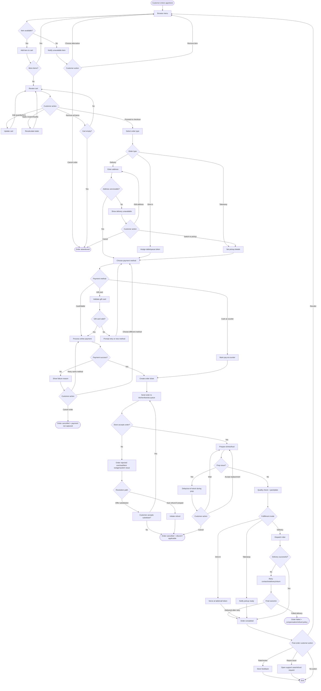

# Coffee Shop Ordering System — Pipeline Graph

```mermaid
flowchart TD
    A([Customer enters app/store]) --> B[Browse menu]
    B --> C{Item available?}
    C -- No --> C1[Notify unavailable item]
    C1 --> C2{Customer action}
    C2 -- Choose alternative --> B
    C2 -- Remove item --> B
    C2 -- Cancel order --> Z1([Order abandoned])

    C -- Yes --> D[Add item to cart]
    D --> E{More items?}
    E -- Yes --> B
    E -- No --> F[Review cart]

    F --> F1{Customer action}
    F1 -- Edit quantity/item --> F2[Update cart]
    F2 --> F
    F1 -- Apply coupon/loyalty --> F3[Recalculate totals]
    F3 --> F
    F1 -- Remove all items --> F4{Cart empty?}
    F4 -- Yes --> Z1
    F4 -- No --> F
    F1 -- Proceed to checkout --> G[Select order type]

    G --> G1{Order type}
    G1 -- Dine-in --> G2[Assign table/queue token]
    G1 -- Takeaway --> G3[Set pickup details]
    G1 -- Delivery --> G4[Enter address]
    G4 --> G5{Address serviceable?}
    G5 -- No --> G6[Show delivery unavailable]
    G6 --> G7{Customer action}
    G7 -- Switch to pickup --> G3
    G7 -- Edit address --> G4
    G7 -- Cancel --> Z1
    G5 -- Yes --> H[Choose payment method]
    G2 --> H
    G3 --> H

    H --> I{Payment method}
    I -- Card/Wallet --> J[Process online payment]
    I -- Cash at counter --> K[Mark pay-at-counter]
    I -- Gift card --> L[Validate gift card]
    L --> L1{Gift card valid?}
    L1 -- No --> L2[Prompt retry or new method]
    L2 --> H
    L1 -- Yes --> J

    J --> M{Payment success?}
    M -- No --> M1[Show failure reason]
    M1 --> M2{Customer action}
    M2 -- Retry same method --> J
    M2 -- Choose different method --> H
    M2 -- Cancel order --> Z2([Order cancelled + payment not captured])

    M -- Yes --> N[Create order ticket]
    K --> N
    N --> O[Send order to kitchen/barista queue]

    O --> P{Store accepts order?}
    P -- No --> P1[Order rejected: overload/item outage/system issue]
    P1 --> P2{Resolution path}
    P2 -- Auto refund if prepaid --> P3[Initiate refund]
    P2 -- Offer substitution --> P4[Customer accepts substitute?]
    P4 -- Yes --> O
    P4 -- No --> Z3([Order cancelled + refund if applicable])
    P3 --> Z3

    P -- Yes --> Q[Prepare drinks/food]
    Q --> R{Prep issue?}
    R -- Yes --> R1[Delay/out-of-stock during prep]
    R1 --> R2{Customer action}
    R2 -- Wait --> Q
    R2 -- Accept replacement --> Q
    R2 -- Cancel --> Z3

    R -- No --> S[Quality check + pack/plate]
    S --> T{Fulfillment mode}
    T -- Dine-in --> U[Serve at table/call token]
    T -- Takeaway --> V[Notify pickup ready]
    T -- Delivery --> W[Dispatch rider]
    W --> W1{Delivery successful?}
    W1 -- No --> W2[Retry contact/redelivery/return]
    W2 --> W3{Final outcome}
    W3 -- Delivered after retry --> X
    W3 -- Failed delivery --> Z4([Order failed + compensation/refund policy])

    U --> X[Order completed]
    V --> X
    W1 -- Yes --> X

    X --> Y{Post-order customer action}
    Y -- Rate/review --> Y1[Store feedback]
    Y -- Report issue --> Y2[Open support case/refund request]
    Y -- Reorder --> B
    Y1 --> END([End])
    Y2 --> END
    Y -- No action --> END
```
